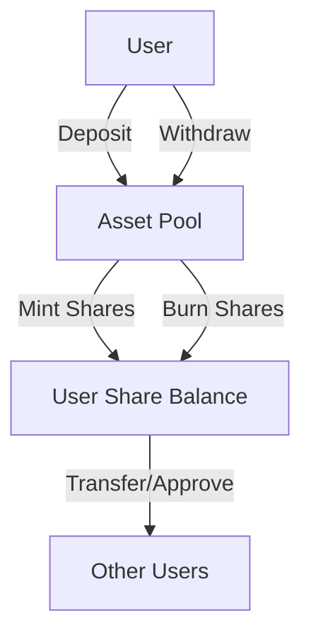

# ERC4626 Elastic Bundler

## Overview

The ERC4626 Elastic Bundler is a dynamic, flexible vault implementation designed to provide enhanced asset management capabilities with an elastic supply mechanism. Built on the Stacks blockchain using Clarity, this smart contract enables fluid token depositing, withdrawal, and share management while maintaining precise accounting and flexibility.

### Key Features

- 🔄 Dynamic share minting and burning
- 💱 Flexible deposit and withdrawal mechanics
- 🔒 Secure access controls
- 📊 Precise asset tracking
- 🛡️ Robust error handling

## Architecture

The contract implements a flexible vault mechanism with the following core components:

- **Asset Management**: Track total assets and shares
- **User Balances**: Individual user deposit and share tracking
- **Allowance System**: Enable share delegation
- **Dynamic Calculations**: Intelligent share and asset conversion



## Getting Started

### Prerequisites

- Clarinet
- Stacks Wallet
- Basic understanding of DeFi principles

### Installation

1. Clone the repository
2. Install dependencies with Clarinet
3. Deploy the contract

### Basic Usage

#### Deposit Assets
```clarity
(contract-call? .elastic-bundler deposit u1000)
```

#### Withdraw Assets
```clarity
(contract-call? .elastic-bundler withdraw u500)
```

#### Check Balance
```clarity
(contract-call? .elastic-bundler balance-of tx-sender)
```

## Functions

### Public Functions

- `deposit`: Add assets to the vault
- `withdraw`: Remove assets from the vault
- `approve`: Allow share spending by another address
- `transfer`: Move shares between accounts

### Read-Only Functions

- `balance-of`: Check user's share balance
- `total-assets-under-management`: Get total vault assets
- `total-supply`: Get total issued shares

## Security Considerations

- Validate all transaction parameters
- Use proper authorization mechanisms
- Implement comprehensive error handling
- Consider external audits for production deployment

## Development

### Testing
```bash
clarinet test
```

### Local Development
```bash
clarinet console
```

## License

MIT License

## Contributing

Contributions welcome! Please see CONTRIBUTING.md for details.